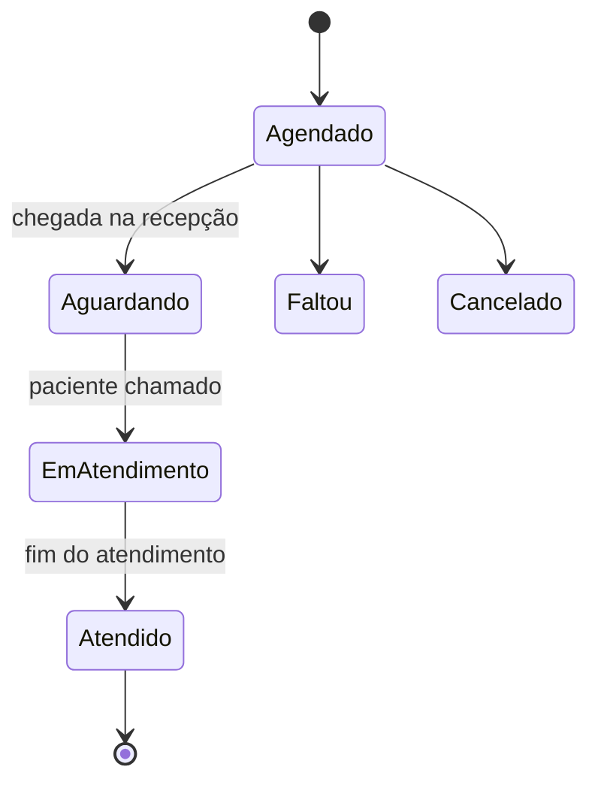
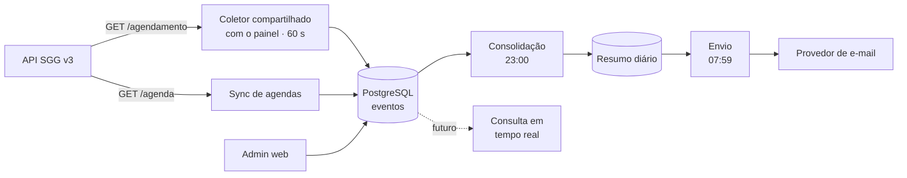

# Relatório Diário de Atendimentos SGG — Documentação Técnica

Sep 24, 2026 · @Tecnologia Multilife

## 1. Visão geral

O sistema entrega, todos os dias às **07:59**, um e-mail com o resumo operacional do dia anterior: atendimentos por turno, faltas, tempo de espera na recepção, tempo de atendimento por agenda e Tempo Médio de Atendimento (TMA) por consultório e turno. Os dados vêm da API REST do SGG (v3), sem digitação manual.

**Objetivo de negócio:** dar à gestão da MultiLife uma visão diária e confiável da operação, substituindo levantamentos manuais e permitindo comparar turnos, consultórios e dias.

**Relação com o Painel de Tempo de Atendimento:** decisão confirmada — este relatório não terá coletor próprio; ele reaproveita o mesmo coletor e a mesma base de eventos do painel em tempo real, na ordem em que cada um for construído (se o painel vier primeiro, este sistema só lê a tabela de eventos; se este vier primeiro, o coletor aqui implementado precisa ser reaproveitável pelo painel). Isso também deixa o projeto pronto para evoluir de um e-mail diário para um relatório em tempo real no futuro, sem trocar coletor nem modelo de dados (ver seção 7).

## 2. Escopo

### Dentro do escopo

- Captura contínua das mudanças de status dos agendamentos via `GET /agendamento/` durante o expediente.
- Armazenamento do histórico de transições (log de eventos) em banco próprio.
- Consolidação noturna das métricas do dia anterior.
- Envio automático do resumo por e-mail às 07:59 para uma lista configurável de destinatários.
- Tela administrativa simples para gerenciar destinatários, turnos, unidades de atendimento e agendas incluídas.
- Reenvio manual de um relatório de qualquer data (para correções e auditoria).

### Fora do escopo (v1)

- Qualquer escrita no SGG (o sistema é somente leitura).
- Painel em tempo real (já coberto pelo projeto do painel).
- Relatórios semanais e mensais (previstos para v2).
- Envio por WhatsApp ou Slack.
- Dados clínicos ou pessoais de pacientes no e-mail: o relatório traz apenas números agregados.

## 3. Restrição crítica: a coleta não pode ser só à noite

A API do SGG devolve apenas o **status atual** de cada agendamento (`situacao`) e a data da última edição (`data_hora_edicao`). Ela não expõe quando o paciente entrou em "Aguardando", "Em Atendimento" ou "Atendido". Uma consulta feita à noite mostraria todos como "Atendido", sem os horários intermediários.

**Decisão de arquitetura:** a coleta acontece em **polling incremental durante o expediente** (06:00–18:00, mesma janela do painel). A cada ciclo, o sistema busca os agendamentos editados desde o último ciclo, compara com o último status gravado e registra cada transição com o horário observado. À noite, apenas consolida esses eventos.

| Aspecto | Coleta só à noite | Polling durante o dia (adotado) |
| --- | --- | --- |
| Atendimentos e faltas | Sim | Sim |
| Tempo de espera | Não | Sim |
| Tempo de atendimento / TMA | Não | Sim |
| Precisão do horário | — | ± intervalo do polling (60 s) |

**Impacto na precisão:** com polling a cada 60 s, cada tempo tem erro máximo de ±60 s. Para reduzir o viés, usar `data_hora_edicao` do registro como horário da transição sempre que ela for posterior à última observação (ela marca exatamente a edição que mudou o status).

**Coletor compartilhado (decisão confirmada):** este sistema não roda um poller próprio. Ele lê o mesmo log de eventos (`agendamento_evento`) gravado pelo coletor do painel — o que estiver pronto primeiro grava os eventos, o outro só lê. Isso evita dois processos escrevendo o mesmo tipo de dado e economiza cota da API do SGG.

## 4. Definição das métricas

Toda métrica é calculada a partir das transições de status do agendamento. Os status válidos na API são: Agendado, Aguardando, Em Atendimento, Atendido, Faltou e Cancelado.



O tempo de espera é medido entre "Aguardando" e "Em Atendimento"; o tempo de atendimento, entre "Em Atendimento" e "Atendido".

| Métrica | Regra de cálculo | Recorte |
| --- | --- | --- |
| Atendimentos realizados | Agendamentos com status final **Atendido** no dia | Turno (manhã/tarde), agenda, total |
| Faltas | Agendamentos com status final **Faltou** no dia | Turno (pela hora agendada), agenda, total |
| Sem baixa | Agendamentos que terminaram o dia em Agendado ou Aguardando, após conferir que não há falta registrada na agenda do consultório (se houver, contam em Faltas) | Total (alerta de qualidade de dados) |
| Tempo de espera na recepção | Horário de "Em Atendimento" − horário de "Aguardando" | Média, mediana e maior espera por turno |
| Tempo de atendimento | Horário de "Atendido" − horário de "Em Atendimento" | Por agenda (todas as agendas) |
| TMA por consultório | Média dos tempos de atendimento válidos do consultório | Consultório × turno |

**Turnos (configuráveis):** Manhã = 06:00 a 12:59; Tarde = 13:00 a 18:00. O turno de qualquer agendamento (atendido, falta ou sem baixa) é definido pela hora agendada, não pelo horário em que o status mudou — um agendamento é da tarde quando a hora agendada for 13:00 ou depois.

**Consultório:** cada agenda do SGG corresponde a um consultório; o nome exibido vem do campo `sala` de `GET /agenda/` (com fallback para o nome da agenda).

**Atendimentos atípicos:** duração menor que 1 min ou maior que 180 min entra na contagem de atendimentos, mas fica fora de médias e TMA, e aparece numa seção de alertas do e-mail (mesma regra do painel).

```latex
TMA_{c,t} = \frac{1}{n}\sum_{i=1}^{n}\left(t^{atendido}_i - t^{em\,atendimento}_i\right)
```

Onde c é o consultório, t o turno e n o número de atendimentos válidos (não atípicos) daquele consultório no turno. Se um paciente passa por mais de uma agenda no dia (ex.: clínico e audiometria), cada passagem conta como um atendimento separado.

## 5. Requisitos funcionais

| ID | Requisito | Prioridade |
| --- | --- | --- |
| RF01 | Fazer polling de `GET /agendamento/` a cada 60 s, das 06:00 às 18:00, filtrando por `editado_aPartirDe` / `editado_ate` desde o último ciclo | Alta |
| RF02 | Registrar cada mudança de status como evento (agendamento, status anterior, novo status, horário) sem duplicar eventos | Alta |
| RF03 | Às 18:30, fazer uma varredura de reconciliação do dia inteiro por `data_hora_agendamento` para pegar alterações perdidas | Alta |
| RF04 | Às 23:00, consolidar as métricas do dia (seção 4) e gravar o resultado em tabela de resumo diário | Alta |
| RF05 | Às 07:59, gerar o e-mail em HTML a partir do resumo gravado e enviar a todos os destinatários ativos | Alta |
| RF06 | Sincronizar diariamente o cadastro de agendas (`GET /agenda/`) para nomes de consultório e unidade | Média |
| RF07 | Tela administrativa com login para cadastrar/desativar destinatários, ajustar horários de turno, selecionar a(s) unidade(s) de atendimento incluída(s) (uma, várias ou todas) e escolher quais agendas entram no relatório | Média |
| RF08 | Permitir reprocessar e reenviar o relatório de uma data específica | Média |
| RF09 | Em dias sem expediente (sem agendamentos), enviar e-mail curto informando "sem movimento" | Baixa |
| RF10 | Se a consolidação falhar, enviar alerta para o e-mail técnico em vez do relatório incompleto | Alta |
| RF11 | Antes de contar um agendamento como "sem baixa", conferir se há falta registrada na agenda do consultório; se houver, contabilizá-lo em Faltas, não em "sem baixa" | Alta |

## 6. Requisitos não funcionais

| ID | Categoria | Requisito |
| --- | --- | --- |
| RNF01 | Limite da API | Nunca passar de 60 req/min entre 05:00 e 20:00 (120 req/min fora disso). Orçamento do sistema: no máximo 40 req/min (a chave é exclusiva deste sistema); a coleta a cada 5 s usa 12 req/min por página. Tratar HTTP 429 com backoff exponencial |
| RNF02 | Pontualidade | E-mail entregue às 07:59 (tolerância de 2 min), horário de Brasília |
| RNF03 | Idempotência | Reexecutar coleta, consolidação ou envio não pode duplicar eventos nem e-mails (controle por data + status de envio) |
| RNF04 | Confiabilidade | Coletor retoma de onde parou após reinício (cursor persistido no banco) |
| RNF05 | Segurança | Chave da API do SGG e credenciais de e-mail só em variáveis de ambiente; nunca no código ou em logs |
| RNF06 | Privacidade (LGPD) | Não armazenar CPF nem nome de paciente; guardar apenas IDs do SGG. E-mail só com números agregados |
| RNF07 | Retenção | Eventos e resumos mantidos por 24 meses; job mensal apaga o excedente. O histórico da coleta dos dias anteriores é compactado para 1 ciclo bem-sucedido por minuto |
| RNF08 | Observabilidade | Logs estruturados (JSON) e registro de cada execução de job com status e duração |
| RNF09 | Manutenibilidade | Cobertura de testes ≥ 80% no módulo de cálculo de métricas |
| RNF10 | Custo | Rodar no plano Hobby/Pro da Railway com 1 serviço + 1 PostgreSQL |

## 7. Arquitetura

Monólito modular em camadas (arquitetura hexagonal / ports & adapters): um único serviço Python na Railway, com o domínio de métricas isolado de I/O. Isso mantém o custo baixo e deixa o cálculo 100% testável sem API nem banco.



O coletor grava eventos brutos; a consolidação transforma eventos em resumo; o envio só lê o resumo pronto. Cada etapa pode ser reexecutada sozinha.

| Camada | Responsabilidade | Depende de |
| --- | --- | --- |
| `domain` | Entidades (Agendamento, Evento, Turno) e cálculo das métricas. Funções puras | Nada |
| `application` | Casos de uso: coletar ciclo, consolidar dia, enviar relatório, reprocessar data | `domain` + interfaces (ports) |
| `infrastructure` | Cliente HTTP do SGG, repositórios PostgreSQL, envio de e-mail, agendador | Bibliotecas externas |
| `interfaces` | API/admin web (FastAPI) e comandos de linha (CLI) para reprocessamento | `application` |

**Princípios adotados:** inversão de dependência (o domínio não conhece a API nem o banco), idempotência em todos os jobs, configuração por ambiente (12-factor) e logs estruturados.

### Evolução futura: do relatório diário para tempo real

A arquitetura já foi pensada para essa evolução: os eventos em `agendamento_evento` são imutáveis e não pertencem só a "ontem" — a consolidação das 23:00 é apenas um caso de uso de leitura entre vários possíveis sobre o mesmo log.

- Modelar em `application` um caso de uso genérico, do tipo `obter_metricas_periodo(inicio, fim)`, reutilizado tanto pela consolidação noturna (`inicio = ontem 00:00`, `fim = ontem 23:59`) quanto por uma futura consulta ao vivo (`inicio = hoje 00:00`, `fim = agora`).
- Quando fizer sentido, adicionar um endpoint (ou WebSocket) em `interfaces/web` que chama esse caso de uso sob demanda — sem novo coletor, sem nova tabela de eventos, só uma nova forma de consultar os mesmos dados.
- `resumo_diario` continua existindo como cache do fechamento do dia; uma consulta em tempo real simplesmente não passaria por essa etapa de cache.

**Implementado (25/09/2026):** monitor ao vivo em `/admin/monitor`, com `ObterMetricasPeriodo` sobre `[hoje 00:00, agora]`, comparação com a semana anterior até o mesmo horário e atualização por HTMX a cada 5 s (coleta a cada 5 s, [ADR 0009](adr/0009-coleta-a-cada-5-segundos.md)), sem nenhuma chamada extra ao SGG. Ver o [ADR 0007](adr/0007-monitor-em-tempo-real.md).

## 8. Stack tecnológica

| Camada | Tecnologia | Motivo |
| --- | --- | --- |
| Linguagem | Python 3.12 | Mesma base do painel; forte em dados |
| Web / admin | FastAPI + Jinja2 + HTMX | Admin simples sem front-end separado |
| Cliente HTTP | httpx + tenacity | Timeouts, retries e backoff para HTTP 429 |
| Agendamento de jobs | APScheduler (processo worker, fuso `America/Sao_Paulo`) | Polling de 60 s não cabe no Cron da Railway (mínimo de 5 min e horário em UTC) |
| Banco | PostgreSQL 16 (plugin da Railway) | Transações, `ON CONFLICT` para idempotência |
| ORM / migrações | SQLAlchemy 2 + Alembic | Migrações versionadas |
| Configuração | pydantic-settings | Variáveis de ambiente tipadas e validadas |
| Template de e-mail | Jinja2 + premailer (CSS inline) | HTML compatível com Outlook e Gmail |
| Envio de e-mail | SMTP (smtplib/aiosmtplib) via KingHost | Decisão do cliente: usar a conta de e-mail da KingHost já em uso pela MultiLife (login, senha e SMTP); validar no spike se a Railway libera saída SMTP nesse plano (seção 10) |
| Logs | structlog (JSON) | Filtrável nos logs da Railway |
| Testes | pytest, respx (mock HTTP), time-machine (congelar horário) | Testar turnos e horários sem esperar o relógio |
| Qualidade | ruff, mypy, pre-commit | Padrão de código automático |
| Dependências | uv (ou Poetry) com lockfile | Builds reproduzíveis |

Decisão confirmada: o envio usa a conta de e-mail da KingHost já em uso pela MultiLife, via SMTP (não HTTP). Diferente do plano original, isso depende da Railway liberar saída SMTP — validar no spike (seção 10); se não liberar, considerar um relay SMTP→HTTP ou trocar de provedor.

## 9. Modelo de dados

Sete tabelas. Os eventos são imutáveis (só inserção); o resumo diário é recalculável a qualquer momento a partir deles.

| Tabela | Campos principais | Observações |
| --- | --- | --- |
| `agenda` | `id_agenda` (PK, do SGG), `nome`, `sala`, `unidade_atendimento`, `ativa`, `incluir_relatorio` | Atualizada pelo sync diário |
| `agendamento_snapshot` | `id_agendamento` (PK), `id_agenda`, `data_agendamento`, `hora_agendamento`, `situacao_atual`, `data_hora_edicao`, `atualizado_em` | Último status conhecido; base para detectar mudança |
| `agendamento_evento` | `id` (PK), `id_agendamento`, `status_anterior`, `status_novo`, `ocorrido_em`, `observado_em`, `origem` (polling/reconciliação) | UNIQUE (`id_agendamento`, `status_novo`, `ocorrido_em`) garante idempotência |
| `resumo_diario` | `data` (PK), `metricas` (JSONB), `versao_regra`, `gerado_em`, `status_envio`, `enviado_em` | Um registro por dia; `status_envio` evita e-mail duplicado |
| `destinatario` | `id`, `email`, `nome`, `ativo`, `criado_em` | Gerenciado na tela admin |
| `execucao_job` | `id`, `job`, `inicio`, `fim`, `status`, `detalhe` | Auditoria e diagnóstico |

**Configurações** (horários de turno, limites de atípico, e-mail técnico) ficam numa tabela `configuracao` chave-valor, editável no admin, com valores padrão nas variáveis de ambiente.

**Índices:** `agendamento_evento (ocorrido_em)` e `agendamento_snapshot (data_agendamento, id_agenda)` para a consolidação do dia.

## 10. Integração com a API do SGG

O sistema usa apenas dois endpoints de leitura: `GET /agendamento/` e `GET /agenda/`.

**Autenticação:** Basic Auth com a chave da API como usuário e senha vazia (`base64("CHAVE:")`). Base URL `https://app.sgg.net.br/api/v3/`, sempre com barra no final. Enviar os filtros como parâmetros de query (mais previsível que corpo JSON em GET).

### Chamadas

| Uso | Endpoint e filtros | Frequência |
| --- | --- | --- |
| Polling incremental | `/agendamento/?editado_aPartirDe=<cursor>&editado_ate=<agora>&paginador[pagina]=N&paginador[tamanho]=100` | A cada 60 s, 06:00–18:00 |
| Reconciliação do dia | `/agendamento/?data_hora_agendamento_aPartirDe=<dia> 00:00:00&data_hora_agendamento_ate=<dia> 23:59:59` paginado | 1×/dia, 18:30 |
| Cadastro de agendas | `/agenda/?paginador[pagina]=N&paginador[tamanho]=100` | 1×/dia, 05:30 |

### Regras do cliente

- Paginação: seguir enquanto `temProximaPagina` for `true`; `tamanho` máximo 100.
- Cursor: `editado_aPartirDe` = último `editado_ate` com sucesso **menos 2 min** de sobreposição (para não perder edições no limite); duplicatas são descartadas pelo UNIQUE da tabela de eventos.
- Formato de data nos filtros: `AAAA-MM-DD HH:mm:ss`, horário de Brasília.
- `D001` (retorno em branco) é sucesso sem dados, não erro.
- HTTP 429: esperar e tentar de novo com backoff exponencial (2 s, 4 s, 8 s… até 60 s). Erros `S0xx`/`E000`: registrar, pular o ciclo e alertar após 10 falhas seguidas.
- Timeout de 15 s por requisição; um único cliente reutilizado (connection pooling).

### Detecção de transição (a cada registro recebido)

1. Ler o `agendamento_snapshot` do ID.
2. Se não existe ou `situacao` mudou: inserir evento (anterior → novo) com `ocorrido_em = data_hora_edicao` e atualizar o snapshot.
3. Se o status pulou etapas (ex.: Aguardando → Atendido sem passar por Em Atendimento), gravar o evento e marcar o atendimento como "sem tempo medido"; ele conta nos totais, mas não entra em médias.

### Validar antes de codar (spike de 1 dia)

- Confirmar que mudar a `situacao` atualiza `data_hora_edicao` e faz o registro aparecer no filtro `editado_aPartirDe`.
- Confirmar o fuso horário dos campos de data retornados.
- Medir quantos agendamentos por dia e quantas páginas por ciclo, para validar o orçamento de 20 req/min.
- Confirmar se uma falta registrada na agenda do consultório (para agendamentos que ficam "sem baixa") aparece via GET /agendamento/ (situação = Faltou) ou exige consulta a outro endpoint/tela.
- Confirmar se a Railway libera saída SMTP (porta 587/465) para o servidor da KingHost nos planos usados; se não liberar, avaliar um relay HTTP→SMTP ou trocar de provedor.

## 11. Jobs e agendamento

Todos os horários são de Brasília (`America/Sao_Paulo`), configurados no APScheduler com `timezone` explícito. O container define `TZ=America/Sao_Paulo`.

| Horário | Job | O que faz | Se falhar |
| --- | --- | --- | --- |
| 05:30 | `sync_agendas` | Atualiza cadastro de agendas/consultórios | Usa o cadastro anterior |
| 06:00–18:00, a cada 5 s | `coletar_ciclo` | Polling incremental e gravação de eventos | Próximo ciclo recupera pela sobreposição do cursor |
| 06:00–18:00, a cada 5 min | `varrer_dia` | Varredura do dia inteiro durante o expediente. Acerta mudanças que o polling por data de edição não viu e fecha (como cancelados) os agendamentos em aberto que sumiram do dia no SGG (remarcados, excluídos ou com situação desconhecida) | A próxima varredura recupera |
| 18:30 | `reconciliar_dia` | Varredura completa do dia para eventos perdidos | Reexecuta às 19:00 e 22:00 |
| 23:00 | `consolidar_dia` | Calcula métricas e grava `resumo_diario` | Reexecuta às 02:00 e 05:00 |
| 07:59 | `enviar_relatorio` | Envia e-mail do dia anterior | 3 tentativas com 2 min de intervalo; depois alerta técnico |
| Dia 1, 03:00 | `limpar_retencao` | Remove dados com mais de 24 meses | Reexecuta no dia seguinte |
| 03:20 | `compactar_execucoes` | Deixa 1 ciclo de coleta bem-sucedido por minuto nos dias anteriores | Reexecuta no dia seguinte |

**Regras de execução:**

- `max_instances=1` e `coalesce=True` em todos os jobs: um ciclo lento nunca roda em paralelo com o próximo.
- Trava por advisory lock do PostgreSQL, para que dois containers (ex.: durante um deploy) não executem o mesmo job.
- O envio das 07:59 só lê `resumo_diario`; se o resumo não existe, tenta consolidar na hora antes de desistir.
- Segunda-feira: o e-mail traz o dia anterior (domingo). Se não houve expediente, vale o RF09 ("sem movimento").

## 12. Layout do e-mail

Assunto: `Resumo de Atendimentos — 23/09/2026 (terça-feira)`. HTML responsivo com a logo padrão da MultiLife, lido em até 1 minuto, seguido de versão texto puro.

1. **Cabeçalho:** logo, data de referência, unidade(s) incluída(s).
2. **KPIs do dia (cards):** Total de atendimentos · Faltas (e % sobre agendados) · Tempo médio de espera na recepção · TMA geral.
3. **Por turno (tabela):** colunas Manhã e Tarde; linhas Atendimentos, Faltas, Espera média, Maior espera, TMA.
4. **TMA por consultório (tabela):** uma linha por consultório; colunas Atendimentos manhã, TMA manhã, Atendimentos tarde, TMA tarde. Ordenado do maior para o menor TMA.
5. **Tempo de atendimento por agenda:** todas as agendas com quantidade, média, mediana e maior tempo.
6. **Comparativo:** variação dos KPIs contra o mesmo dia da semana anterior (▲/▼ e %).
7. **Alertas:** atendimentos atípicos (<1 min ou >180 min), agendamentos sem baixa e falhas de coleta no dia (ex.: "coleta indisponível das 10:12 às 10:40").
8. **Rodapé:** horário de geração, versão da regra de cálculo e link para o admin.

O template fica em `templates/email/resumo_diario.html` e recebe só o JSON de `resumo_diario.metricas`, sem lógica de cálculo no template.

## 13. Estrutura do projeto e boas práticas

```
relatorio-atendimentos/
├── src/relatorio/
│   ├── domain/            # entidades, turnos, cálculo de métricas (funções puras)
│   ├── application/       # casos de uso + ports (interfaces)
│   ├── infrastructure/
│   │   ├── sgg/           # cliente HTTP, paginação, retry, mapeamento DTO → domínio
│   │   ├── db/            # modelos SQLAlchemy, repositórios
│   │   ├── email/         # adaptador do provedor de e-mail
│   │   └── scheduler.py   # registro dos jobs
│   ├── interfaces/
│   │   ├── web/           # FastAPI: admin, /health
│   │   └── cli.py         # reprocessar --data 2026-09-23, enviar --data ...
│   └── config.py          # pydantic-settings
├── templates/email/
├── migrations/            # Alembic
├── tests/
│   ├── unit/              # domínio (sem rede, sem banco)
│   ├── integration/       # repositórios com Postgres de teste, cliente SGG com respx
│   └── fixtures/          # respostas reais anonimizadas da API
├── Dockerfile
├── .railway/railway.ts    # infraestrutura na Railway (IaC; aplicada com a CLI)
├── pyproject.toml
└── README.md
```

**Boas práticas obrigatórias:**

- Domínio sem import de `httpx`, `sqlalchemy` ou `fastapi`; dependências entram por interfaces.
- Cálculo de métricas versionado (`versao_regra` no resumo): mudou a regra, sobe a versão e reprocessa.
- Todo horário tratado como `datetime` com fuso (timezone-aware); proibido `datetime.now()` sem fuso.
- Git flow simples: `main` protegida, branch por funcionalidade, Pull Request com CI (ruff, mypy, pytest) antes do merge.
- Commits no padrão Conventional Commits (`feat:`, `fix:`, `chore:`).
- README com como rodar localmente (`docker compose up`), variáveis de ambiente e como reprocessar um dia.
- Registro de decisões (ADR) em `docs/adr/` para escolhas como "polling em vez de coleta noturna".

## 14. Deploy na Railway

Um projeto Railway com três serviços, todos a partir do mesmo repositório GitHub (deploy automático a cada merge na `main`).

| Serviço | Comando de início | Réplicas | Observação |
| --- | --- | --- | --- |
| `web` | `uvicorn relatorio.interfaces.web.app:app --host 0.0.0.0 --port $PORT` | 1 | Admin + `/health`; domínio gerado pela Railway |
| `worker` | `python -m relatorio.infrastructure.scheduler` | 1 (fixo) | Sempre ligado; roda todos os jobs; sem domínio público |
| `postgres` | Plugin PostgreSQL | — | Backups ativados na Railway |

**Pre-deploy command** (nos dois serviços de app): `alembic upgrade head`.

A configuração dos dois serviços de app (Dockerfile, início, pre-deploy, health check, réplicas e reinício) está em `.railway/railway.ts` (Infrastructure as Code da Railway, aplicada com `railway config apply`). Ela substituiu o `railway.json` (Config as Code, descontinuado em 01/12/2026). Ver o ADR 0008.

**Health check:** `web` expõe `/health`, que responde 200 e informa o horário do último ciclo de coleta; se o último ciclo tiver mais de 5 min em horário de coleta, responde 503.

### Variáveis de ambiente

| Variável | Exemplo | Uso |
| --- | --- | --- |
| `DATABASE_URL` | referência `${{Postgres.DATABASE_URL}}` | Conexão com o banco |
| `SGG_API_KEY` | (secreta) | Chave de 32 caracteres do SGG |
| `SGG_BASE_URL` | `https://app.sgg.net.br/api/v3/` | URL base |
| `SGG_MAX_RPM` | `40` | Orçamento de requisições por minuto |
| `COLETA_INTERVALO_S` | `5` | Segundos entre ciclos de coleta (divisor de 60, de 5 a 60) |
| `SMTP_HOST` | mail.kinghost.net (confirmar com o provedor) | Endereço do servidor SMTP da KingHost |
| `SMTP_PORT` | 587 | Porta do servidor SMTP (confirmar STARTTLS x SSL direto com a KingHost) |
| `SMTP_USER` | relatorios@multilife.com.br | Login da caixa usada para envio |
| `SMTP_PASSWORD` | (secreta) | Senha da caixa de e-mail |
| `EMAIL_FROM` | `relatorios@multilife.com.br` | Remetente (domínio verificado com SPF/DKIM) |
| `EMAIL_ALERTA_TECNICO` | tecnologia@multilife.com.br | Alertas de falha |
| `ADMIN_USER` / `ADMIN_PASSWORD_HASH` | (secretas) | Login do admin |
| `TZ` | `America/Sao_Paulo` | Fuso do container |
| `LOG_LEVEL` | `INFO` | Nível de log |

**Ambientes:** `staging` (apontando para uma chave de API de teste ou com envio de e-mail só para o time de TI) e `production`, usando os Environments da Railway.

## 15. Testes, observabilidade e segurança

### Testes

| Tipo | O que cobre | Casos obrigatórios |
| --- | --- | --- |
| Unitário (domínio) | Cálculo de todas as métricas | Atendimento cruzando 12:59→13:00; atípicos <1 e >180 min; salto de status; dia sem agendamentos; paciente em duas agendas |
| Unitário (detecção) | Snapshot → evento | Mesmo registro recebido duas vezes não duplica evento |
| Integração (SGG) | Cliente HTTP com respx | Paginação com `temProximaPagina`; HTTP 429 com retry; `D001` vazio |
| Integração (banco) | Repositórios e UNIQUE | Idempotência do evento e do `status_envio` |
| Ponta a ponta | Dia simulado com fixtures reais | E-mail gerado confere com cálculo manual feito em planilha |

**Critério de aceite da v1:** durante 5 dias úteis em staging, os números do e-mail batem com a conferência manual no SGG (tolerância de ±1 min nos tempos médios e 0 de diferença nas contagens).

### Observabilidade

- Logs JSON com `job`, `ciclo_id`, `requisicoes`, `eventos_novos`, `duracao_ms`.
- Tabela `execucao_job` consultável pelo admin (últimas 7 execuções de cada job).
- Alerta por e-mail técnico: 10 ciclos seguidos com falha, consolidação falhou após 3 tentativas, ou envio das 07:59 não concluído até 08:10.

### Segurança

- HTTPS no admin (padrão da Railway); senha com hash bcrypt; bloqueio após 5 tentativas.
- Segredos só nas variáveis da Railway; rotação da chave do SGG documentada no README.
- Nenhum dado pessoal de paciente em banco, log ou e-mail (LGPD); apenas IDs do SGG e números agregados.
- Dependências verificadas no CI (`pip-audit`).

## 16. Plano de entrega e decisões pendentes

### Fases

| Fase | Entrega | Duração estimada |
| --- | --- | --- |
| 0. Spike | Validar filtro `editado_aPartirDe`, fuso e volume diário (seção 10) | 1 dia |
| 1. Fundação | Repositório, CI, Docker, Railway (staging), banco e migrações | 2 dias |
| 2. Coleta | Cliente SGG, polling, detecção de transição, reconciliação | 3 dias |
| 3. Métricas | Domínio de cálculo + testes unitários + consolidação | 3 dias |
| 4. E-mail | Template, provedor, job das 07:59, alertas | 2 dias |
| 5. Admin | Destinatários, configurações, reprocessamento, histórico de jobs | 2 dias |
| 6. Homologação | 5 dias úteis em staging com conferência manual | 1 semana |
| 7. Produção | Deploy em production e acompanhamento da primeira semana | 1 dia |

Total: cerca de 3 semanas de desenvolvimento + 1 semana de homologação, contando com coletor próprio. Como o coletor é compartilhado com o painel (decisão confirmada), as fases 1 e 2 caem para cerca de 2 dias assim que qualquer um dos dois projetos tiver o coletor pronto.

**Decisão confirmada nesta revisão:** a coleta segue o modelo do painel em tempo real — coletor único compartilhado entre os dois projetos — para que o relatório diário possa evoluir para um relatório em tempo real no futuro sem refazer a base de eventos (seções 1, 3 e 7).

### Decisões confirmadas

- [x] Tempo de espera "para ser chamado à recepção": confirmado como o intervalo de "Aguardando" até "Em Atendimento" (proposta original mantida).
- [x] Horário de corte entre turnos: confirmado em 13:00. Um agendamento é considerado da tarde quando a hora agendada for 13:00 ou depois (turno definido pela hora agendada, não pelo horário de atendimento — ver seção 4).
- [x] Agendamentos que terminam o dia em "Agendado" ("sem baixa"): confirmado — antes de contar como "sem baixa", conferir a agenda do consultório; se houver falta registrada lá, contam como 1 falta, não como "sem baixa" (ver seção 4 e spike na seção 10).
- [x] Provedor de e-mail: confirmado — envio pela KingHost, via SMTP (login, senha e endereço SMTP configurados), e não por Microsoft 365 ou serviço transacional HTTP (ver seções 8 e 14).
- [x] Relatório por unidade de atendimento: confirmado — o relatório é gerado para a(s) unidade(s) selecionada(s) previamente (uma, várias ou todas), com a possibilidade de escolher também quais agendas entram no relatório (ver RF07).
- [x] Lista inicial de destinatários: confirmada — glauco@multilife.com.br e tecnologia@multilife.com.br.
